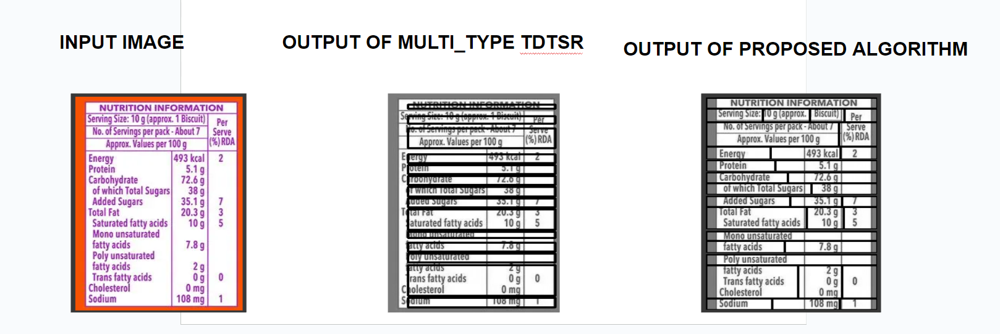
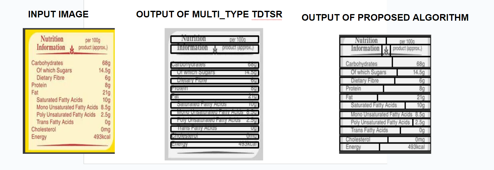
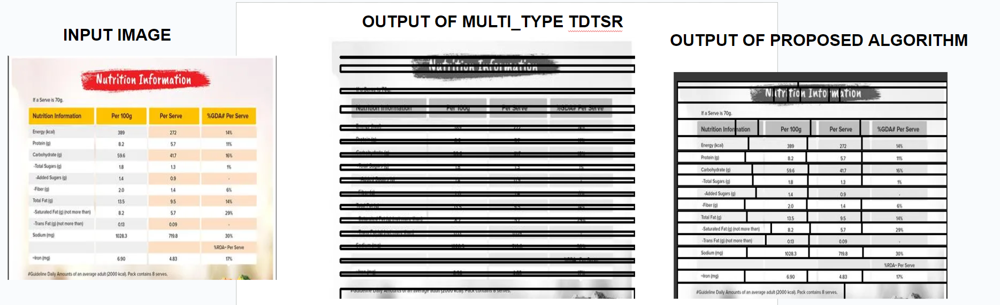

# TableDigitalizer

This project is an improvement over the algorithms released in paper Multi-Type-TD-TSR. 
The Paper:
[Multi-Type-TD-TSR](https://arxiv.org/abs/2105.11021) Extracting Tables from Document Images using a Multi-stage Pipeline for Table Detection and Table Structure Recognition
and the [source code](https://github.com/Psarpei/Multi-Type-TD-TSR/tree/main) 

The original algorithm cannot deal with column spanning or row spanning. The algorithm proposed here has been optimised for column spanning as will be depicted from the following images

## Example 1


## Example 2


## Example 3


Algorithm for color invariance is also proposed in the code, during experimentations the proposed algorithm was found to be more robust than the one proposed in the original paper.

## Web Application
A Flask based web application has also been developed which can be run  - 
After cloning the repository, run
``` python tsr.py ```

The original algorithms reside in author.py and the new tailored ones are present in self.py
